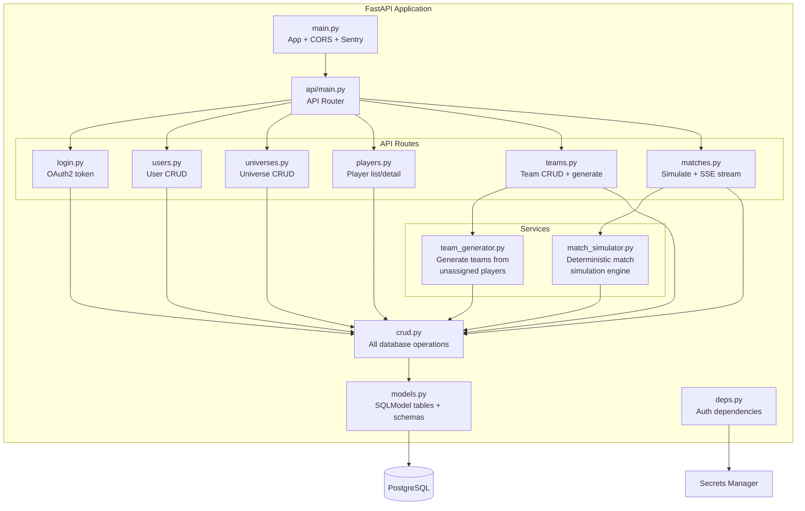
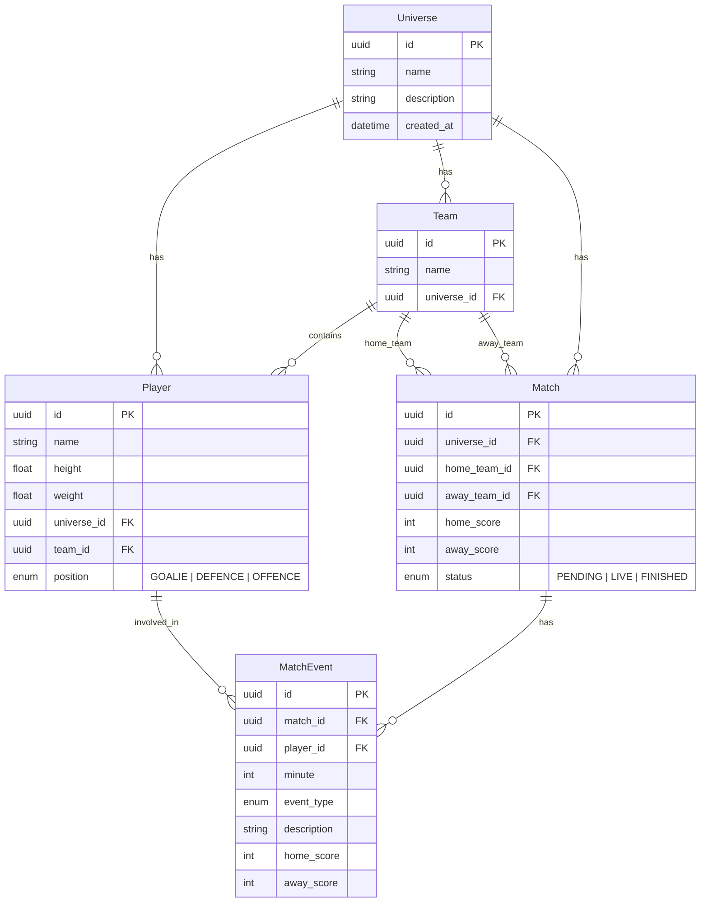
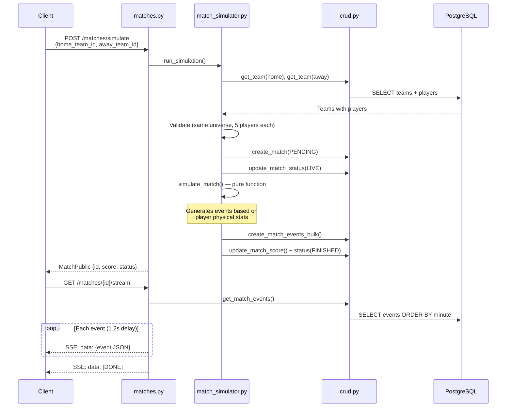
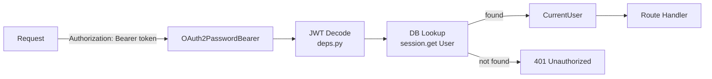

# Backend Architecture

## Overview

FastAPI application with a layered architecture: API routes delegate to services for business logic and CRUD functions for database operations. All models are defined in a single `models.py` file using SQLModel.

## Domain Model

## Match Simulation Flow

## Authentication Flow

## Team Generation Logic

Players are assigned positions based on physical attributes:

| Position | Selection Criteria | Rating Derivation |
|----------|-------------------|-------------------|
| Goalie (1) | Tallest available player | Height normalized (150-220cm) |
| Defence (N) | Heaviest remaining players | Avg weight normalized (50-120kg) |
| Offence (N) | Shortest remaining players | Inverse height (shorter = faster) |

Defenders + Attackers must equal 4 (total team size = 5).

## API Endpoints

| Method | Path | Auth | Description |
|--------|------|------|-------------|
| POST | `/api/v1/login/access-token` | No | Get JWT token |
| GET | `/api/v1/users/me` | Yes | Current user |
| GET | `/api/v1/universes/` | No | List universes |
| GET | `/api/v1/players/` | No | List players (optional universe filter) |
| GET | `/api/v1/teams/` | No | List teams (optional universe filter) |
| POST | `/api/v1/teams/generate` | No | Generate team from universe players |
| GET | `/api/v1/matches/` | No | List matches (optional universe filter) |
| POST | `/api/v1/matches/simulate` | No | Simulate match between two teams |
| GET | `/api/v1/matches/{id}` | No | Match details with events |
| GET | `/api/v1/matches/{id}/stream` | No | SSE stream of match events |
