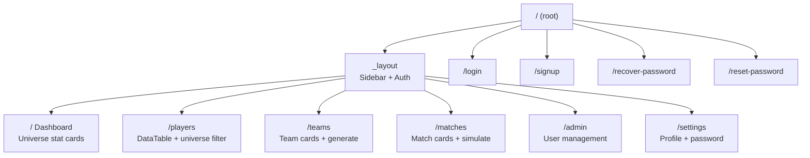
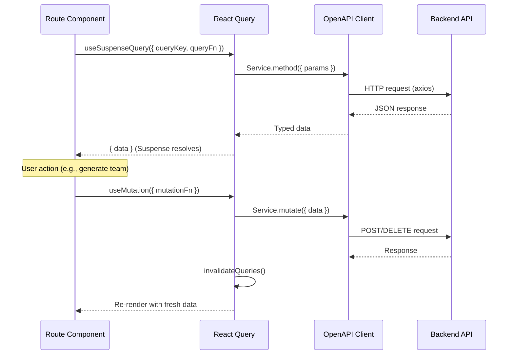
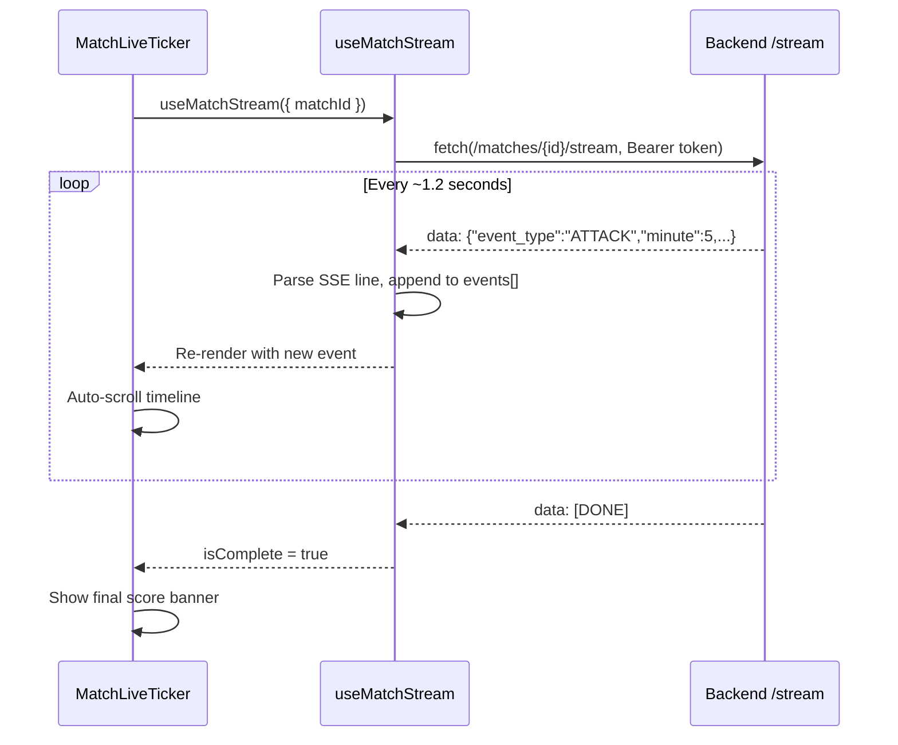

# Frontend Architecture

## Overview

React 19 SPA using TanStack Router (file-based routing), TanStack React Query (server state), and shadcn/ui (component library). The OpenAPI client is auto-generated from the backend schema.

```mermaid
graph TB
    subgraph "React Application"
        subgraph "Routes (TanStack Router)"
            root[__root.tsx]
            layout[_layout.tsx<br/>Auth guard + Sidebar]
            dash[index.tsx<br/>Dashboard]
            players[players.tsx<br/>Players page]
            teams[teams.tsx<br/>Teams page]
            matches[matches.tsx<br/>Matches page]
            admin[admin.tsx<br/>Admin page]
            settings[settings.tsx<br/>Settings page]
            login[login.tsx]
        end

        subgraph "Feature Components"
            UC[Universes/<br/>UniverseCard]
            PC[Players/<br/>columns]
            TC[Teams/<br/>GenerateTeam<br/>TeamCard<br/>DeleteTeam]
            MC[Matches/<br/>SimulateMatch<br/>MatchLiveTicker<br/>MatchCard<br/>MatchEventItem]
        end

        subgraph "Shared Components"
            DT[Common/DataTable<br/>server-side pagination]
            UF[Common/UniverseFilter<br/>dropdown with "All"]
            SB[Sidebar/AppSidebar]
            UI[ui/ — shadcn components<br/>Card, Dialog, Select,<br/>Badge, Tabs, Skeleton...]
        end

        subgraph "Data Layer"
            RQ[React Query<br/>useSuspenseQuery<br/>useMutation<br/>useQueries]
            Client[OpenAPI Client<br/>auto-generated<br/>sdk.gen.ts + types.gen.ts]
            SSE[useMatchStream<br/>fetch + ReadableStream]
        end
    end

    API[Backend API]

    root --> layout
    layout --> dash & players & teams & matches & admin & settings
    root --> login

    dash --> UC
    players --> PC & DT & UF
    teams --> TC & DT & UF
    matches --> MC & UF

    UC & PC & TC & MC --> RQ
    RQ --> Client
    Client -->|HTTP/axios| API
    MC --> SSE
    SSE -->|SSE/fetch| API
```

## Route Structure



## Data Flow



## Match Live Ticker (SSE)



## Component Hierarchy per Page

### Players Page
```
PlayersPage
  Suspense → PlayersPageContent
    Header (title + UniverseFilter)
    Suspense → PlayersTable
      DataTable (server-side pagination)
        columns.tsx (name, height, weight, position badge)
```

### Teams Page
```
TeamsPage
  Suspense → TeamsPageContent
    Header (title + UniverseFilter + GenerateTeam button)
    Suspense → TeamsGrid
      TeamsList
        TeamCard (name, position badges, player roster)
          DeleteTeam (confirmation dialog)
```

### Matches Page
```
MatchesPage
  Suspense → MatchesPageContent
    Header (title + UniverseFilter + SimulateMatch button)
    Suspense → MatchesGrid
      MatchCard (teams, score, status, date)
    LiveMatchDialog (on simulate)
      MatchLiveTicker (scoreboard + event timeline)
        MatchEventItem (styled by event type)
    MatchDetailDialog (on click past match)
      MatchReplay (all events at once)
```

## State Management

| State Type | Tool | Example |
|-----------|------|---------|
| Server state | React Query | Players, teams, matches, universes |
| URL state | TanStack Router search params | `?universe=<id>` filter |
| Pagination | React `useState` | `pageIndex`, `pageSize` in Players page |
| UI state | React `useState` | Dialog open/close, selected match |
| SSE streaming | Custom hook (`useMatchStream`) | Live match events array |

## Key Patterns

- **Suspense boundaries** — Every data-fetching component wrapped in `<Suspense fallback={<Skeleton />}>` for loading states
- **Universe filter via URL** — `validateSearch` with Zod schema, `useNavigate` to update search params
- **Query invalidation** — Mutations invalidate relevant query keys on `onSettled`/`onComplete`
- **Toast notifications** — `useCustomToast` hook for success/error feedback via Sonner
- **Auto-generated client** — `scripts/generate-client.sh` regenerates `sdk.gen.ts` + `types.gen.ts` from backend OpenAPI schema
