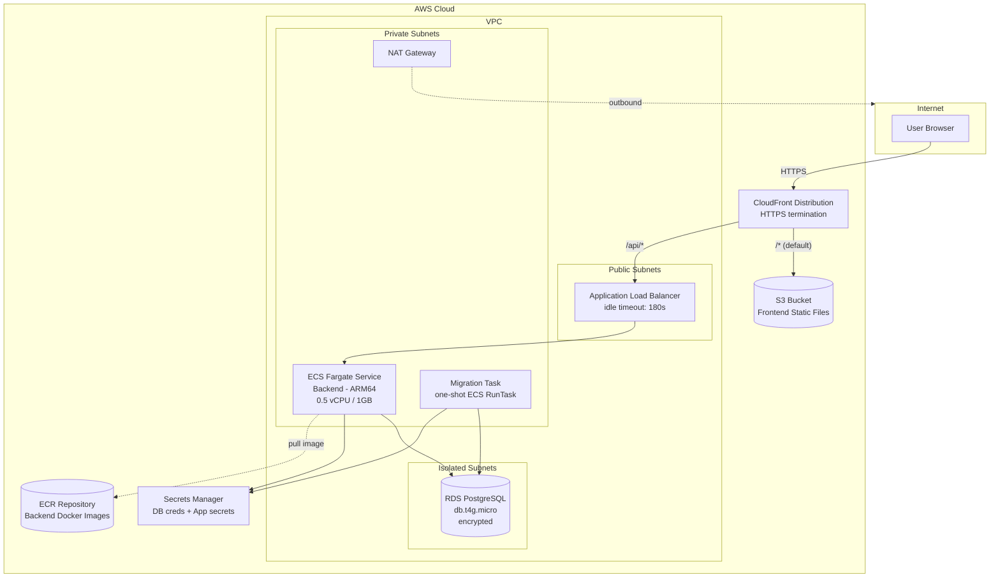
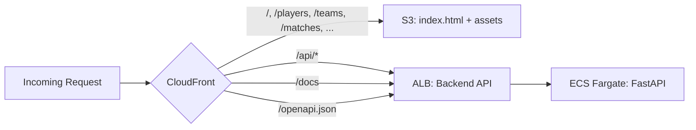
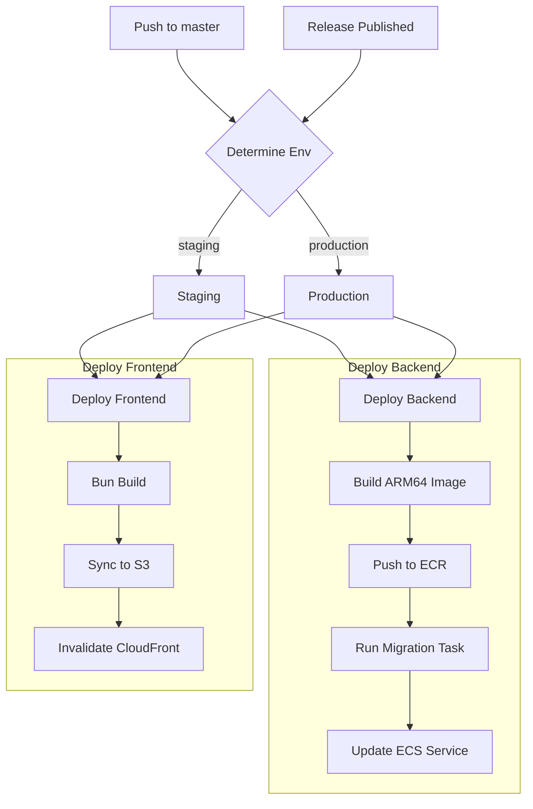
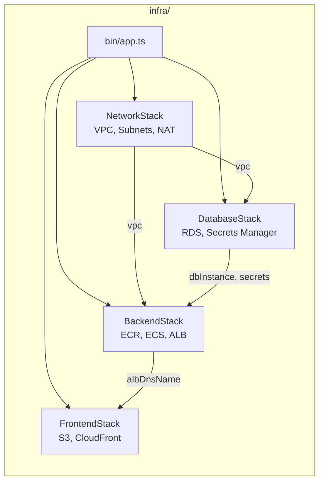

# Infrastructure Architecture

## AWS Production Architecture

Single CloudFront distribution serves both the React SPA (from S3) and the FastAPI backend (via ALB), eliminating CORS and providing a unified HTTPS endpoint.

## Request Routing

## CI/CD Pipeline

## CDK Stack Organization

## Cost Breakdown (~$78/mo)

| Resource | Monthly Cost |
|----------|-------------|
| NAT Gateway | ~$32 |
| ALB | ~$17 |
| RDS (db.t4g.micro) | ~$12 |
| ECS Fargate (ARM64) | ~$12 |
| S3 + CloudFront | ~$2 |
| ECR + Secrets + Logs | ~$3 |
